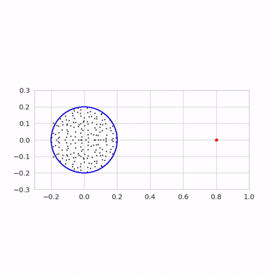
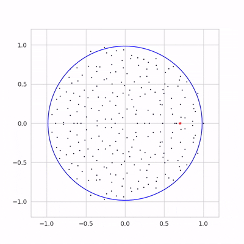

## Dynamically Learning to Integrate in Recurrent Neural Networks  

This github repo contains code to reproduce experiments from the paper [Dynamically Learning To Integrate in Recurrent Neural Networks](https://arxiv.org/abs/2503.18754)

### Rich Regime (Outlier Escape)

### Lazy Regime (No single outlier governs dynamics) 

